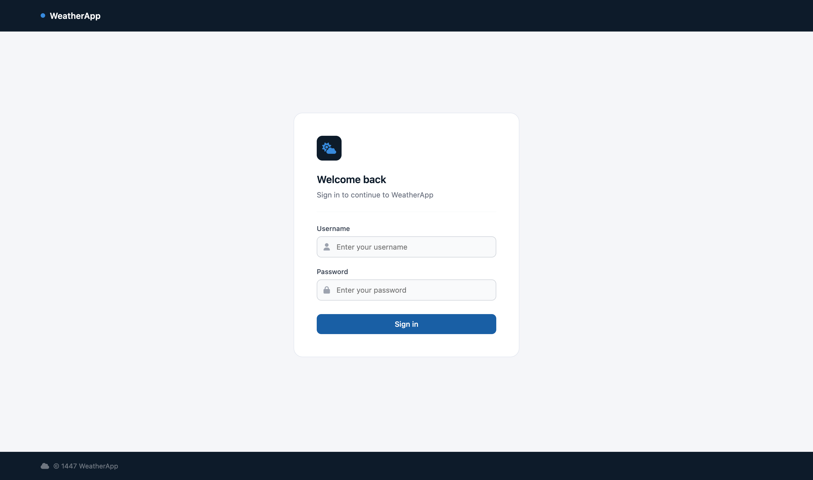
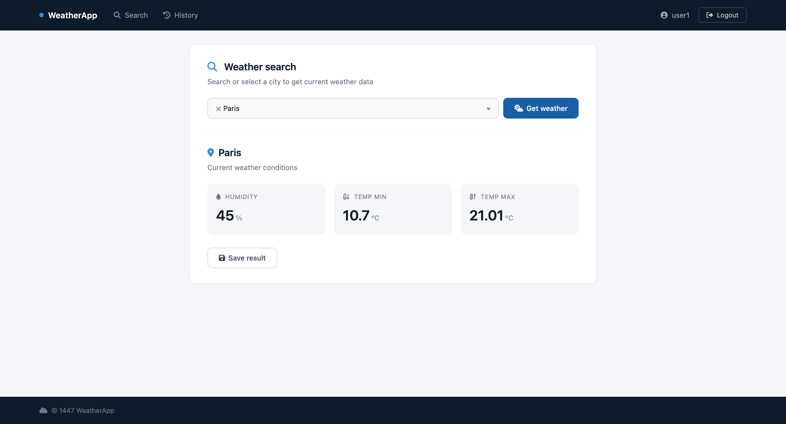
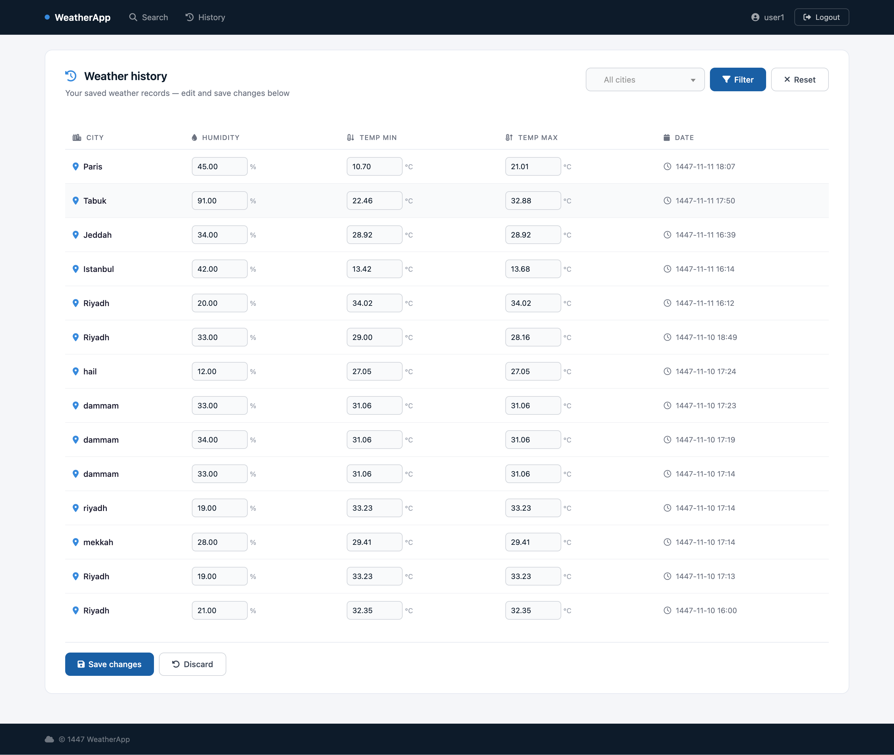

# 🌤 WeatherApp

> A full-stack ASP.NET Core MVC web application built with C# and Microsoft SQL Server as part of an interview assignment.

---

## 📸 Screenshots

### Login Page
<!-- Add screenshot here -->


### Weather Search
<!-- Add screenshot here -->


### Weather History
<!-- Add screenshot here -->


---

## 🛠 Tech Stack

| Layer | Technology |
|---|---|
| Backend | ASP.NET Core MVC, C# |
| Database | Microsoft SQL Server |
| ORM | Entity Framework Core |
| Authentication | ASP.NET Core Identity |
| Frontend | Razor Views, Bootstrap 5, CSS |
| Icons | Font Awesome 6 |
| External API | OpenWeatherMap API |

---

## ✨ Features

### 🔐 Authentication
- Pre-seeded users stored in the database with encrypted passwords
- Login page with front-end and back-end validation
- Session-based authentication using ASP.NET Core Identity
- Protected routes — unauthenticated users are redirected to login

### 🌍 Weather Search (Page 2)
- Searchable city dropdown
- Fetches real-time weather data from OpenWeatherMap API
- Displays Humidity, Min Temperature, and Max Temperature
- Save results to the database with the logged-in user and current date

### 📋 Weather History (Page 3)
- View all saved weather records in a table
- Filter records by city using a searchable dropdown
- Inline editable table — edit multiple records at once
- Changes are not saved to the database until the Save Changes button is clicked
- Full audit log — every field change is recorded with the user, date, time, and field name

### 🗄️ Database
- All database operations use stored procedures
- Foreign key constraints between tables
- Audit trail table for tracking all record changes

---

## 🗃️ Database Tables

| Table | Description |
|---|---|
| `AspNetUsers` | Identity users with encrypted passwords |
| `WeatherRecords` | Saved weather search results |
| `WeatherAudits` | Audit log for all record changes |

---

## ⚙️ Stored Procedures

| Procedure | Description |
|---|---|
| `sp_InsertWeatherRecord` | Save a new weather result |
| `sp_GetWeatherHistory` | Get saved records with optional city filter |
| `sp_GetWeatherRecordById` | Get a single record by ID |
| `sp_UpdateWeatherRecord` | Update a weather record |
| `sp_InsertAudit` | Log a field change |

---

## 📁 Project Structure

```
WeatherApp/
├── 📂 Controllers/
│   ├── AuthController.cs
│   └── WeatherController.cs
├── 📂 Data/
│   ├── AppDbContext.cs
│   └── DbSeeder.cs
├── 📂 Helpers/
│   └── CityList.cs
├── 📂 Migrations/
├── 📂 Models/
│   ├── ApplicationUser.cs
│   ├── LoginViewModel.cs
│   ├── WeatherAudit.cs
│   ├── WeatherRecord.cs
│   └── WeatherResult.cs
├── 📂 Services/
│   ├── WeatherDbService.cs
│   └── WeatherService.cs
├── 📂 Views/
│   ├── 📂 Auth/
│   │   └── Login.cshtml
│   ├── 📂 Shared/
│   │   └── _Layout.cshtml
│   └── 📂 Weather/
│       ├── Index.cshtml
│       └── History.cshtml
└── 📂 wwwroot/
    └── 📂 css/
        └── site.css
```

---

## 🚀 Getting Started

### ✅ Prerequisites
- .NET 10 SDK
- Microsoft SQL Server
- OpenWeatherMap API key (free at https://openweathermap.org)

### 📦 Setup

**1. Clone the repository**
```bash
git clone https://github.com/afnmo/WeatherApp.git
cd WeatherApp
```

**2. Update `appsettings.json` with your connection string and API key**
```json
{
  "ConnectionStrings": {
    "DefaultConnection": "Server=YOUR_SERVER;Database=WeatherApp;Trusted_Connection=True;"
  },
  "OpenWeather": {
    "ApiKey": "YOUR_API_KEY"
  }
}
```

**3. Run migrations to create the database**
```bash
dotnet ef database update
```

**4. Create the stored procedures in SQL Server Management Studio**

Run the stored procedure scripts found in the `/SQL` folder.

**5. Run the application**
```bash
dotnet run
```

---

## 👤 Default Users

| Username | Password  |
|----------|-----------|
| user1    | User@123  |
| user2    | User@123  |

---

## 📝 Notes

- 🔒 Passwords are encrypted using ASP.NET Core Identity's built-in password hashing
- 🗄️ All database operations go through stored procedures as required
- 📋 The audit log captures every individual field change, not just the record as a whole
- 🌐 Weather data is fetched from OpenWeatherMap's current weather and forecast endpoints
